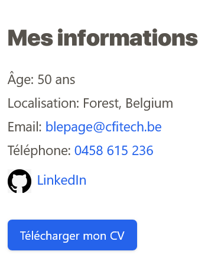

# Homepage

>Maintenant que nous avons les requétes de base pour afficher les données dynamiques, nous allons passer en frontend pour developper les components.
>Ainsi que le post Project.

## developper les composants.

tools: Tailwindcss, Timber/Twig

image cookbook: https://timber.github.io/docs/v2/guides/cookbook-images/#using-webp-images

- hero
  
- skills
  
- experiences
  
- Use case projects
  
- parcours professionnel
  
- Information
  
- Slider
  Glide JS go to doc : https://glidejs.com/docs/getting-started/
